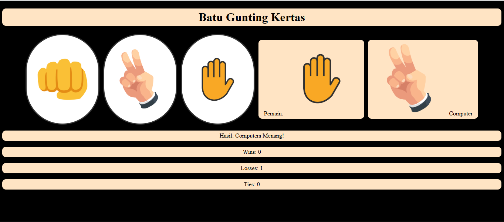
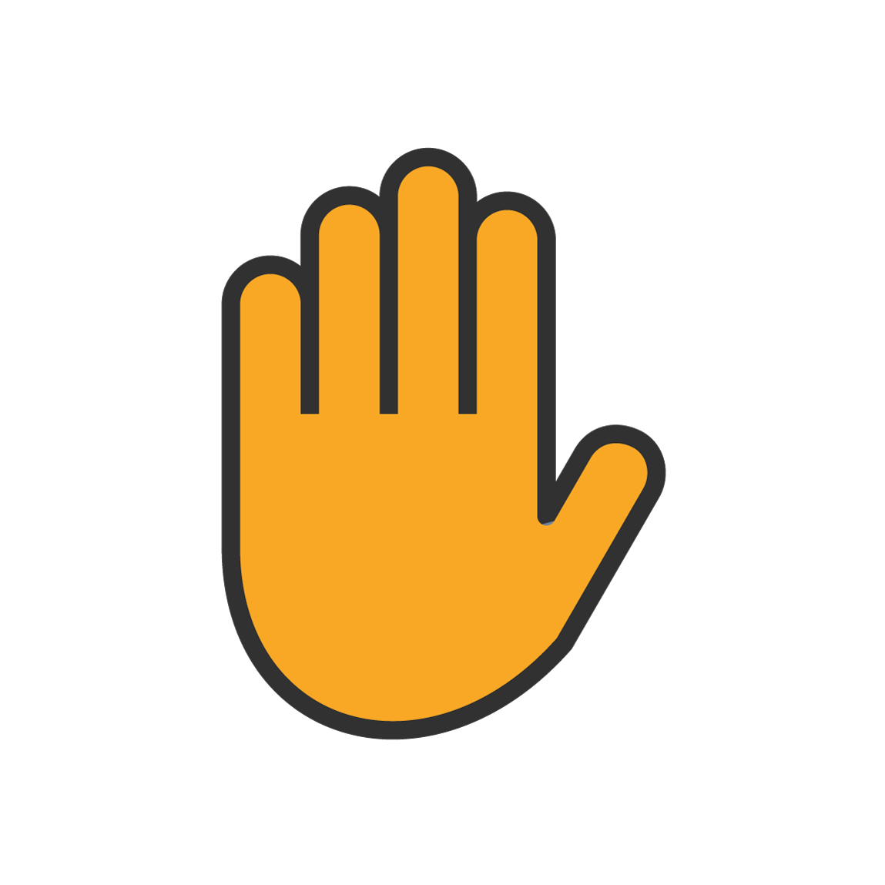

# Pengalaman Belajar di Dicoding

**14 Juni 2021** 
Belajar kelas Memulai Pemrograman dengan Java. (Progres 21%)
* Belajar tentang apa itu Java dan alasan menggunakannya.
* Belajar tools yang dapat digunakan untuk menjalankan bahasa pemrograman Java.

**15 Juni 2021** 
Belajar kelas Memulai Pemrograman dengan Java. (Progres 56%)
* Belajar dasar-dasar Java, seperti struktur dasar, tipe data, string, operator, input output, dan array.
* Belajar control flow dalam Java, seperti perulangan dan percabangan.
* Belajar tipe data koleksi, seperti list, set, dan map.

**20 Juni 2021** 
Belajar kelas Memulai Pemrograman dengan Java. (Progres 100%)
* Belajar konsep OOP (Object-Oriented Programming) untuk mempermudah pengembangan sebuah program.
* Belajar class-class yang sering digunakan dalam bahasa Java seperti generic, exception, input output, date time, dan casting.
* Berlatih dengan membuat program untuk menghitung suhu air, vokal konsonan, dan bangun datar.
* Mengerjakan ujian akhir untuk menilai kemahiran diri.
* Lulus dengan nilai baik

# Rock, Paper, Scissors Game

Welcome to the **Rock, Paper, Scissors** game. Play against the computer and see who wins!

## Gameplay

- Click on one of the options (Rock, Paper, or Scissors) to make your choice.
- The computer will randomly pick one as well.
- The result will be shown below.

### Game Screen

### Example:

Here’s how the images for **Rock**, **Paper**, and **Scissors** might look like when displayed in the game:

#### Rock:

#### Paper:

#### Scissors:

---

## Instructions

1. **Click a button**: Choose Rock, Paper, or Scissors.
2. **View Result**: The winner (you or the computer) will be displayed.
3. **Check Score**: Your win, loss, and tie count will be updated after each round.

---
